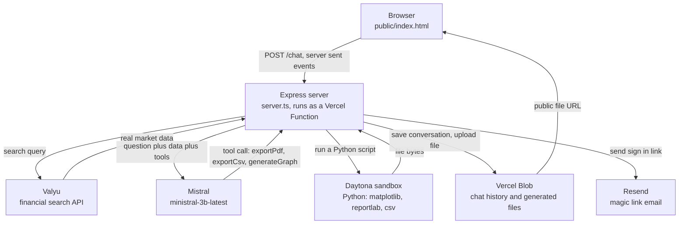
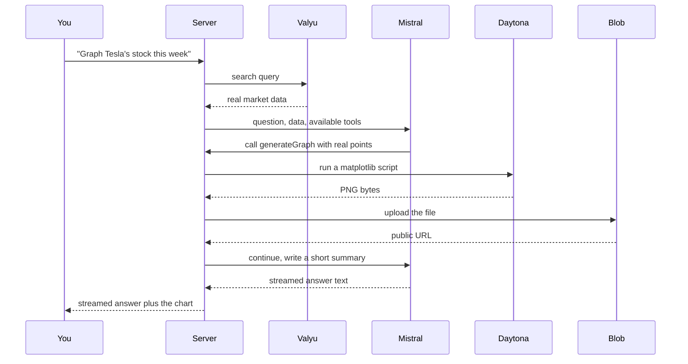

# Finance Assistant

A finance research chat app. Ask it about a stock, a company, or a market, and it answers using live search data instead of whatever the model already "knows." It can also turn that research into a PDF report, a CSV export, or a chart, generated on the fly, and it remembers your conversations if you sign in.

Live at [finance-agent-theta-ochre.vercel.app](https://finance-agent-theta-ochre.vercel.app).


## What it actually does

You type a question. The server searches Valyu for real market data first, then hands that data to a language model along with the question, so the model is answering from actual figures rather than guessing. If you tick PDF, CSV, or Graph, the model can call a tool that runs a short Python script in an isolated Daytona sandbox: matplotlib for charts, reportlab for formatted PDF reports, the csv module for exports. Whatever it produces gets uploaded to Vercel Blob and comes back as a real downloadable file, embedded right in the chat.


Sign in with just an email address (no password, a magic link gets sent to your inbox) and your chats are saved to your account instead of a throwaway browser session.

## How it is put together



Nothing runs on a traditional server. The whole backend is a single Express app that Vercel deploys as one serverless function, so it has to behave statelessly: no local disk to write to between requests, no in memory session that survives past one invocation. Every piece of state (a saved conversation, a generated chart, a pending sign in token) has to live somewhere external, which is why Vercel Blob does double duty as both the file store and the database.

A single deliverable request looks like this end to end:



## Why it is built this way

The model started out as a local Ollama model (qwen2.5:3b) so nothing would cost money while the core logic was being worked out. That model turned out to be unreliable at the one thing this app depends on most, calling tools correctly and consistently, so it was swapped for Mistral's hosted `ministral-3b-latest`. It is a small, cheap model, and it actually honors `toolChoice: required` instead of silently ignoring it, which the local model did not.

PDF and CSV generation started out using `pdfkit` and writing files straight to a local `outputs/` folder. That fell apart the moment this moved to Vercel: serverless functions get an ephemeral filesystem, and anything written to disk during one request is simply gone by the next one, possibly on a different machine entirely. The fix was to run the actual generation code (matplotlib charts, reportlab PDFs) inside a Daytona sandbox, a disposable cloud environment spun up per request, and pull the finished file back as raw bytes rather than a path on disk. Those bytes then get uploaded to Vercel Blob, which returns a real public URL, so the "file" is never something the server has to hold onto.

Chat history has the exact same problem for the exact same reason. There used to be an in memory map of conversations, which is fine on a machine that stays running and pointless on a platform that might throw your process away after every request. Conversations are now read and written directly from Blob on every request, keyed by chat id, and once accounts exist, keyed by account email under a separate prefix so a signed in user's history is not visible to anyone browsing as a guest.

Authentication is deliberately passwordless. Typing an email, getting a link, clicking it, is less code and fewer ways to get it wrong than storing and resetting passwords, and Resend makes sending that one email straightforward. The session itself is a signed cookie, HMAC signed with a server side secret, not a JWT library, since the entire payload is just an email address and an expiry timestamp and did not need one.

Deployment surfaced its own lesson. This is a two directory repository (the actual app lives in `finance-bot/`, one level under the git root), and Vercel's automatic deploys on every push use a project setting called Root Directory to know where to actually build from. Left at the default, every push built an essentially empty project in about two seconds and still reported success, silently replacing a working deployment with a broken one. Manual deploys from inside the correct folder worked the whole time, which is exactly what made it confusing, since the app looked fine locally right up until a push quietly took it down. Root Directory now points at `finance-bot`, and every deploy since has built for real.

## Deep research, in progress

`finance-bot/lib/research.ts` holds an experimental deeper research mode: instead of one search and one answer, it plans out several search queries, runs them, checks whether it actually has enough to answer confidently, searches again if not, and only then writes a final answer with the sources numbered and cited inline. The Fast, Standard, and Deep buttons in the UI already send that choice to the server. The server does not act on it yet, that loop is not wired into the main chat handler, so today every request behaves the same regardless of which one is selected.

## Project layout

```
finance-bot/
  server.ts              the whole backend: chat endpoint, auth routes, chat history
  api/index.ts            exports server.ts as a single Vercel serverless function
  lib/
    ai.ts                 model configuration (Mistral)
    auth.ts                session cookies and magic link tokens
    email.ts               sends the sign in email through Resend
    research.ts            the deep research loop, not yet wired in
  tools/
    search.ts              queries Valyu for real financial data
    graph.ts                draws charts in a Daytona sandbox
    exportPdf.ts            builds PDF reports in a Daytona sandbox
    exportCsv.ts            builds CSV exports in a Daytona sandbox
  public/
    index.html              the entire frontend, one file, no build step
  vercel.json              routes every request through the one serverless function
```

## Running it locally

```
cd finance-bot
npm install
npm run dev
```

You will need a `.env` file inside `finance-bot/` with the following.

```
MISTRAL_API_KEY=
VALYU_API_KEY=
DAYTONA_API_KEY=
BLOB_READ_WRITE_TOKEN=
AUTH_SECRET=
RESEND_API_KEY=
```

`BLOB_READ_WRITE_TOKEN` comes from a Vercel Blob store, even for local development, since chat storage always goes through Blob rather than the local disk. `AUTH_SECRET` can be any random string, used to sign session cookies.

## Deploying

It is a single Vercel project. The important setting to check is Root Directory under Project Settings, which needs to point at `finance-bot` since the repository root is one level above it, for the reason described earlier. Beyond that, set the same environment variables listed above in the Vercel dashboard and connect a Blob store under the Storage tab, which injects `BLOB_READ_WRITE_TOKEN` automatically.
