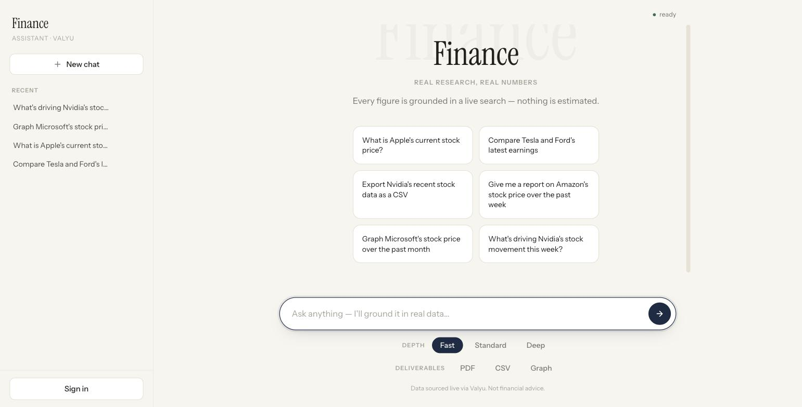
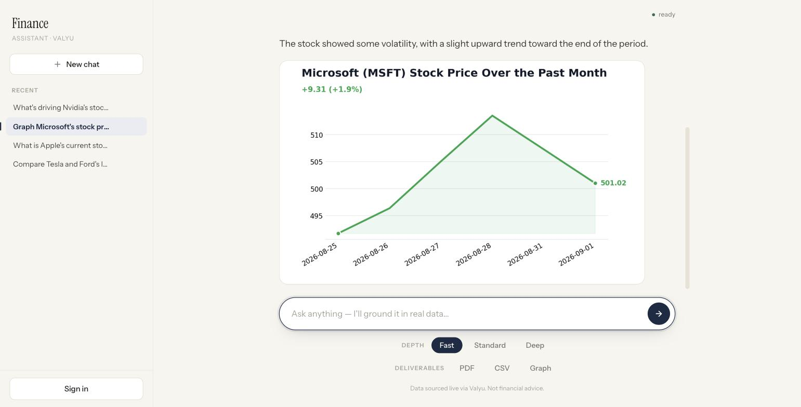
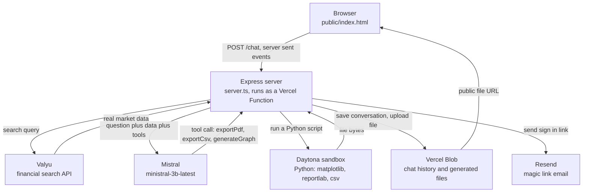
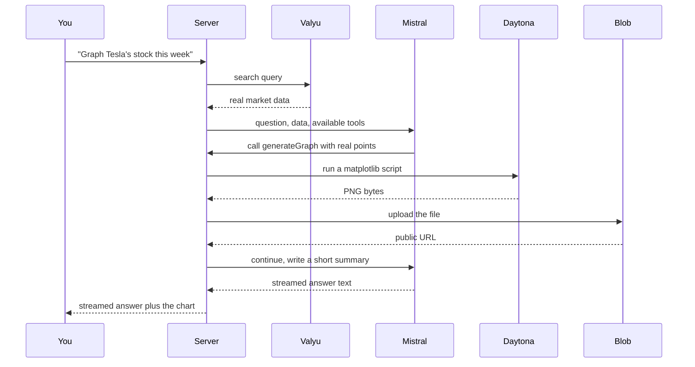

# Finance Assistant

A finance research chat app. Ask it about a stock, a company, or a market, and it answers using live search data instead of whatever the model already "knows." It can also turn that research into a PDF report, a CSV export, or a chart, generated on the fly, and it remembers your conversations if you sign in.

Live at [finance-agent-theta-ochre.vercel.app](https://finance-agent-theta-ochre.vercel.app).

## What it actually does

You type a question. The server searches Valyu for real market data first, then hands that data to a language model along with the question, so the model is answering from actual figures rather than guessing. If you tick PDF, CSV, or Graph, the model can call a tool that runs a short Python script in an isolated Daytona sandbox: matplotlib for charts, reportlab for formatted PDF reports, the csv module for exports. Whatever it produces gets uploaded to Vercel Blob and comes back as a real downloadable file, embedded right in the chat.

Sign in with just an email address (no password, a magic link gets sent to your inbox) and your chats are saved to your account instead of a throwaway browser session.

## How it is put together

Nothing runs on a traditional server. The whole backend is a single Express app that Vercel deploys as one serverless function, so it has to behave statelessly: no local disk to write to between requests, no in memory session that survives past one invocation. Every piece of state (a saved conversation, a generated chart, a pending sign in token) has to live somewhere external, which is why Vercel Blob does double duty as both the file store and the database.

A single deliverable request looks like this end to end:

